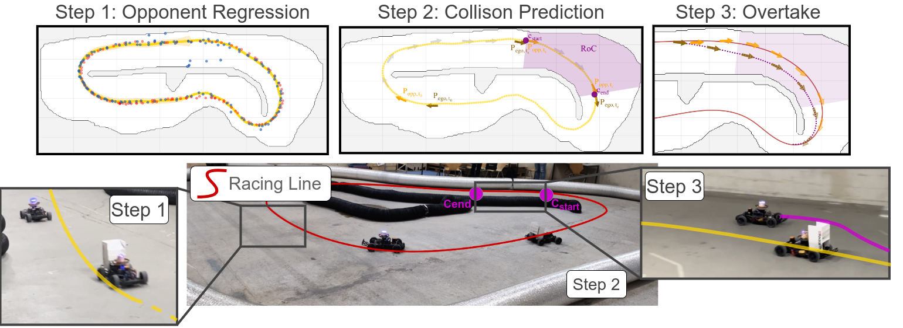

# Predictive Spliner: Data-Driven Overtaking in Autonomous Racing
<a href="http://arxiv.org/abs/2410.04868">
    
</a>

Predictive Spliner is a data-driven overtaking planner for autonomous racing, leveraging opponent trajectory prediction through Gaussian Process (GP) regression. The algorithm computes effective overtaking maneuvers while considering both spatial and temporal information, enhancing performance and safety during head-to-head races. Check out our preprint [Predictive Spliner: Data-Driven Overtaking in Autonomous Racing](http://arxiv.org/abs/2410.04868) on ArXiv for more information. Or check out our explanatory [Youtube video](https://www.youtube.com/watch?v=Zqd-OcUf77k).



## Key Features
- **Data-Driven Approach:** Learns opponent behavior and predicts future trajectories for safe overtaking.
- **High Performance:** Achieves up to 83.1% of its own speed during overtaking with an average success rate of 84.5%.
- **Experimental Validation:** Tested on a 1:10 scale autonomous racing platform with a robust comparison to state-of-the-art algorithms.

## Installation
The predictive spliner planner is part of the [ForzaETH Race Stack](https://github.com/ForzaETH/race_stack). Please refer to the [installation guide](https://github.com/ForzaETH/race_stack/blob/main/INSTALLATION.md) for detailed instructions and perform the quickstart guide below to run the planner.

# Quickstart Guide
This is how to run the predictive spliner planner with the headtohead node in the base simulator. The same steps can be followed analogously to run the planner on the physical robot.

Start a roscore:
```bash
roscore
```
Launch the base simulator with the desired map and sim true:
```bash
roslaunch stack_master base_system.launch sim:=True racecar_version:=SIM map_name:=f
```
Launch headtohead with the predictive_spliner as planner. Note: that perception is set to `False` due to the simulated opponent not providing any perception data, hence set it to `True` when testing on the physical robot:
```bash
roslaunch stack_master headtohead.launch perception:=False planner:=predictive_spliner
```
Launch a dummy obstacle publisher:
```bash
roslaunch obstacle_publisher obstacle_publisher.launch speed_scaler:=0.3
```
Start `rqt` and enable the overtaking sectors:
```bash
rqt
```

Refer to this video to see the quickstart in action: [Quickstart Video](https://drive.google.com/file/d/1LsW0w8d9_j87QMiO1_ByDNJKnnVSB6d2/view?usp=sharing)


## Citing Predictive Spliner

If you found our stack helpful in your research, we would appreciate if you cite it as follows:
```
@misc{baumann2024predictivesplinerdatadrivenovertaking,
      title={Predictive Spliner: Data-Driven Overtaking in Autonomous Racing Using Opponent Trajectory Prediction}, 
      author={Nicolas Baumann and Edoardo Ghignone and Cheng Hu and Benedict Hildisch and Tino Hämmerle and Alessandro Bettoni and Andrea Carron and Lei Xie and Michele Magno},
      year={2024},
      eprint={2410.04868},
      archivePrefix={arXiv},
      primaryClass={cs.RO},
      url={https://arxiv.org/abs/2410.04868}, 
}
```
